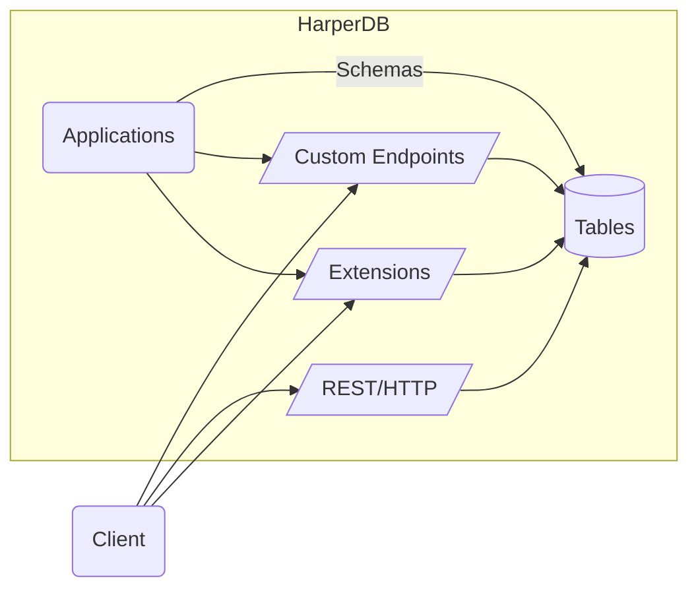

# Mermaid

```mermaid
flowchart LR
	Client(Client)-->Endpoints
	Client(Client)-->HTTP
	Client(Client)-->Extensions
	subgraph HarperDB
	direction TB
	Applications(Applications)-- "Schemas" --> Tables[(Tables)]
	Applications-->Endpoints[/Custom Endpoints/]
	Applications-->Extensions
	Endpoints-->Tables
	HTTP[/REST/HTTP/]-->Tables
	Extensions[/Extensions/]-->Tables
	end
```
